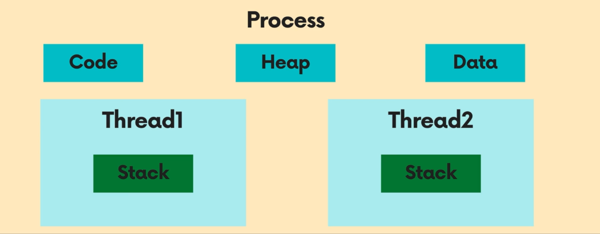

# 01장 1.5 ~ 1.7

소유자: 김채린  
태그: 리액트딥다이브  
생성 일시: 2024년 7월 18일 오전 11:08    
<br>

# 1.5 이벤트 루프와 비동기 통신의 이해

자바스크립트는 한번에 하나의 작업만 동기 방식으로 처리할 수 있다.

자바스크립트는 분명히 싱글 스레드에서 동기 방식으로 작동하는데, 그러나 우리는 웹페이지에서 다양한 비동기 작업을 수행한다.

## 1.5.1 싱글 스레드 자바스크립트

프로세스 : 프로그램을 구동해 프로그램 상태가 메모리상에서 실행되는 작업 단위

스레드 : 하나의 프로그램에 하나의 프로세스가 할당되는데, 그것보다 더 작은 실행단위로 스레드끼리는 메모리를 공유하여 여러 작업을 동시에 수행가능

싱글 스레드 : 코드를 한줄 한줄 실행하며 하나의 작업이 끝나기 전까지 뒤이은 작업 실행 X (= 동기식)

참조 : https://velog.io/@nowhhk/프로세스와-스레드



<br/>


## 1.5.2 이벤트 루프란?

](/img/ch1/1.5.2EventLoop.png)

참조 : [https://www.youtube.com/watch?v=zi-IG6VHBh8](https://www.youtube.com/watch?v=zi-IG6VHBh8)


Heap : 변수들 저장하는 공간

Stack : 코드나 함수들이 들어가서 실행되는 공간, 한번에 코드 한줄만 실행

Event Loop : 스택에 실행 중인 코드가 있는지, 큐에 대기 중인 함수가 있는지 반복해서 확인하는 역할, 큐를 한개 이상 가지고 있다.

Queue : setTimeout 같은 것들이 대기하는 대기실, Stack 이 비면 올려줌

## 1.5.3 태스크 뮤와 마이크로 태스크 큐

Event Loop 는 하나의 마이크로 태스크 큐를 가진다.

마이크로 태스크 큐는 태스크 큐 보다 우선권을 갖는다.

- Task queue : setTimeout, seInterval, setImmediate
- Micro Task queue : process.nextTick, Promises, queueMicroTask, MutationObserver

브라우저에 렌더링하는 작업은 Micro Task queue 와 Task queue 사이에서 일어난다.

## 1.5.4 정리

태스크 큐, 이벤트 루프, 마이크로 태스크 큐, 브라우저/Node.js API 등 적절한 생태계를 이루고 있어서

싱글 스레드로는 불가능한 비동기 이벤트 처리가 가능해 졌다.

# 1.6 리엑트에서 자주사용하는 JS 문법

## 1.6.1 구조 분해 할당

구조 분해 할당 : 객체의 값을 분해해 개별 변수에 즉시 할당하는 것

### 배열 구조 분해 할당

```jsx
//배열 분해 할당에는 기본값을 선언할 수 있다.
//만약 사용하고자 하는 배열 길이가 짧거나 값이 없는 경우 undefined 기본값을 사용한다.

//반드시 undefined 일때만 기본값을 사용한다.
const [a=10, b=10, c=10, d=1, e=1] = [undefined, null, 0, '']
a //1
b //null
c //a
d //''
e //1
```

### 객체 구조 분해 할당

배열 구조 분해 할당과 달리, 객체는 객체 내부 이름 으로 꺼내 온다.

그리고 새로운 이름으로 다시 할당하는 것 또한 가능하다.

```jsx
const object = {
	a: 1,
	b: 2
}

const {a: first, b: second } = object
//first 1
//second 2
```

## 1.6.2 전개 구문

전개 구문 : 구조 분해 할당과 달리 배열/ 객체/ 문자열 과 같이 순회 할 수 있는 값에 대해 전개해 간결하게 사용하는 구문

### 배열의 전개 구문

```jsx
const arr1 = ['a', 'b']
const arr2 = arr1

arr1 === arr2 //true. 내용이 아닌 참조를 복사하기 때문에 true가 반환된다.

const arr1 = ['a', 'b']
const arr2 = [...arr1]

arr1 === arr2 //false. 실제로 값만 복사했을 뿐. 참조는 다르므로 flase가 반환된다.
```

### 객체의 전개 구문

```jsx
const obj1 = { a: 1, b: 2 };
const obj2 = { ...obj1, b: 3 }; // obj1의 프로퍼티를 전개하고, b 프로퍼티를 3으로 덮어씌움

console.log(obj2); // { a: 1, b: 3 }
```

## 1.6.4 Array 프로토타입의 메서드 : map, filter, reduce, forEach

### filter

필터링하는 역할의 메서드로 truthy 조건을 만족하는 경우에만 해당 원소를 반환한다.

```jsx
const arr = [1, 2, 3, 4, 5]
const evenArr = arr.filter((item) => item % 2 === 0)
//[2, 4]
```

### reduce

배열을 순회하면서 각 요소를 누적(accumulate)하여 단일 값으로 줄이는(reduce) 기능을 제공한다.

아래와 같이 배열 > 객체 로 변환 가능하다.

```jsx
const fruits = ['apple', 'banana', 'orange'];

const fruitObject = fruits.reduce((accumulator, currentValue) => {
  accumulator[currentValue] = true;
  return accumulator;
}, {});

console.log(fruitObject);
// { apple: true, banana: true, orange: true }
```

### forEach

배열을 순회하며 단순히 콜백 함수를 실행한다.

주의할 점 : 반환값이 없다, 에러를 던지거나 프로세스를 종료하지 않는 이상 멈출 수 없다.(=무조건 0(n) 만큼 실행 된다.)
<br/>    

# 1.7 선택이 아닌 필수, 타입스크립트


타입스크립트 추가 공부 : 

[https://youtu.be/GHHUjITelsA?si=JqNhicPBjnOh2jva](https://youtu.be/GHHUjITelsA?si=JqNhicPBjnOh2jva)

[https://youtu.be/V9XLst8UEtk?si=j5NUAs_YuHN2mPt9](https://youtu.be/V9XLst8UEtk?si=j5NUAs_YuHN2mPt9)


제네릭 설명 영상 : https://www.youtube.com/watch?v=pReXmUBjU3E